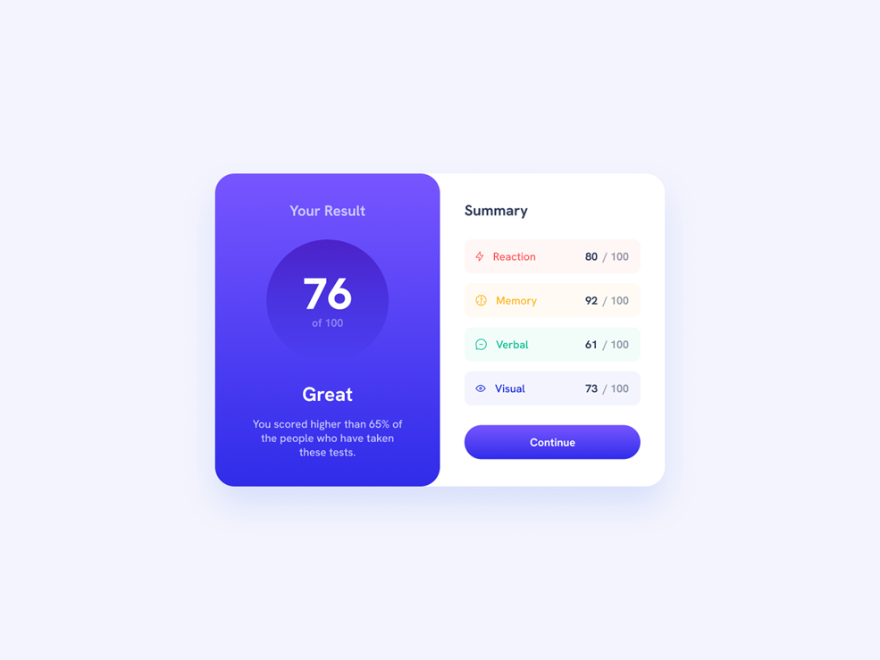

# Task 1: Results Card

Create a centered results summary card interface that matches the provided design mockup, focusing primarily on CSS implementation with emphasis on HSL color knowledge, card styling, typography hierarchy, and layout techniques without flexbox. Your task emphasizes mastering CSS positioning, gradient backgrounds, circular score displays, progress indicators with colored icons, and achieving pixel-perfect visual accuracy to the design.