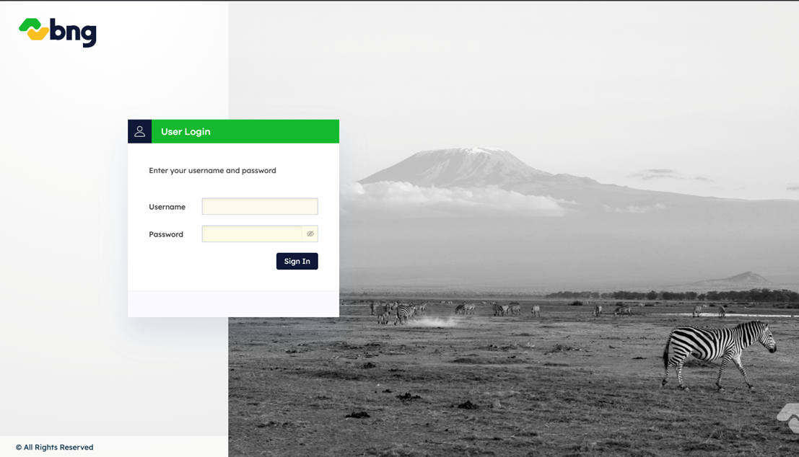

# Task 2: Log In Page

Create a login page interface that matches the provided design mockup, focusing primarily on CSS implementation with minimal JavaScript for basic form interactions (input focus states and button hover effects only - no actual authentication required). Your task emphasizes mastering CSS layout techniques without flexbox, background image positioning, form styling with proper input field design, overlay effects, logo placement, and achieving visual accuracy to the design.