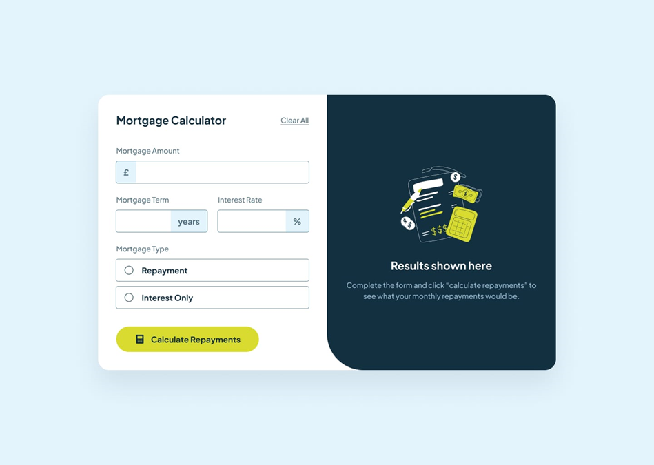

# Task 3: Mortgage Calculator

Create a mortgage calculator interface that matches the provided design mockup, focusing primarily on CSS implementation with minimal JavaScript for basic interactivity (opening/closing the modal and form interactions only - no actual calculations required). Your task emphasizes mastering CSS layout techniques without flexbox, form styling, modal positioning, and achieving visual accuracy to the design.