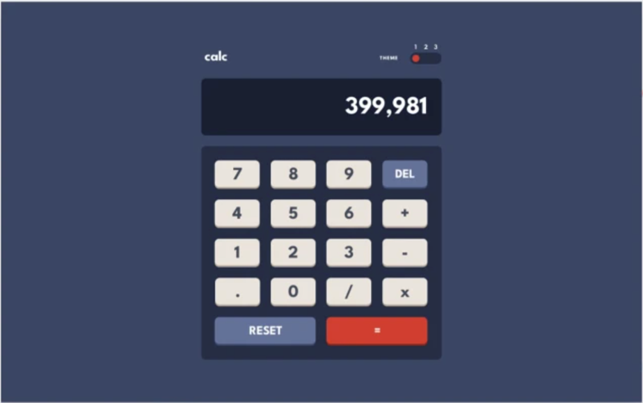

# Task 4: Calculator

Create a calculator interface that matches the provided design mockup with two separate implementations to compare CSS layout methods - one version built using Flexbox and another using CSS Grid, focusing primarily on button grid layouts, display styling, and visual design consistency. Your task emphasizes understanding the differences between Flexbox and Grid approaches for calculator button arrangements, color schemes, typography, and achieving pixel-perfect recreation of the interface using basic JavaScript for button interactions and display updates.